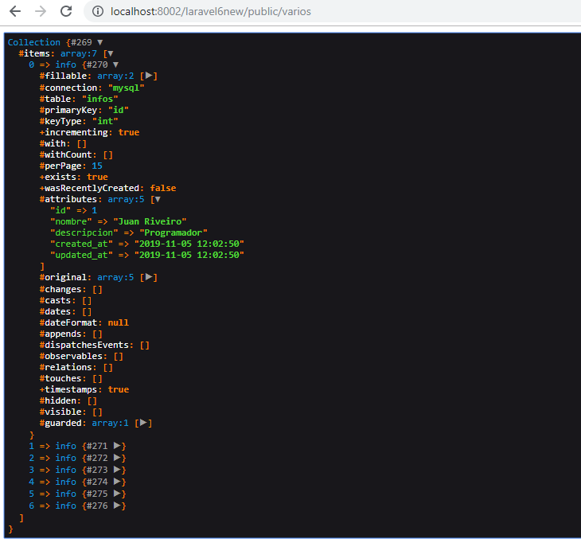

# Trabajando con el Entorno Laravel

## Requisitos previos: 

## Comandos para crear un proyecto: 

Tenemos dos formas de crear un proyecto en laravel, la forma tradicional, y la forma de instalación permanente. 

La instalación tradicional: 

composer 

Creación del proyecto con intalación general: 
laravel new project-name


Para instalar las funciones necesarias. 

composer require laravel/ui 

Para comenzar con la autenticación. 
php artisan ui vue  

Esto instala la parte de autenticación. 
php artisan ui:auth  

Esto nos instalará los estilos, dejando una página mucho más bonita.

npm install && npm run dev 


## Las Rutas. 
Las rutas son las direcciones que ponemos en la barra de direcciones. Estas son manejada en laravel dentro de la carpeta routes. 


```php
Route::get('hola',function(){
    return 'Hola Juan Ramón';
});

// Ejemplo con un parámetro con valor por defecto
Route::get('usuario/{nombre?}',function($nombre='Invitado'){
    return 'Hola ' . $nombre;
});

// Ejemplo con más de un parámetro
Route::get('usuario/{nombre}/comentario/{comentarioid}',function($nombre,$comentarioid){
    return 'Hola ' . $nombre . ' el comentario es ' . $comentarioid;
});

// Ruta con una condición. Solo direcciona si son letras
Route::get('user/{nombre}',function($nombre){
    return 'Usuario ' . $nombre;
})->where('nombre','[A-Za-z]+');

// Solo para datos numéricos
Route::get('user1/{id}',function($id){
    return 'Usuario ' . $id;
})->where('nombre','[0-9]+');


// Solo para datos numéricos
Route::get('user1/{id}',function($id){
    return 'Usuario ' . $id;
})->where('id','[0-9]+');

// Ejemplo con varios parámetros de diferentes tipos: 
Route::get('user2/{id}/{nombre}',function($id,$nombre){
    return 'Usuario ' . $id . ' y el nombre ' . $nombre;
})->where(
    [
        'id' => '[0-9]+',
        'nombre' => '[A-Za-z]+'
    ]
);

// Otros Métodos. Método name
Route::get('prueba',function(){
    return 'Página de prueba';
})->name('pruebaroute');

// La anterior le da un nombre, y esta lo redirige hacía esa entrada. 
Route::get('dirigirprueba',function(){
    return redirect()->route('pruebaroute');
});

Route::get('usuario5/{nombre?}',function($nombre='Invitado'){
    return 'Hola ' . $nombre;
})->name('usuarionombre');

// Ejemplo redirigiendo a una ruta que tenía un parámetro. Se pasa en un array
Route::get('redirigirprueba1',function(){
    return redirect()->route('usuarionombre',['nombre'=>'Juan']);
});


// Redirección simple
Route::redirect('/prueba7','/prueba');
```


## Usando controladores

Para generar un controlador usando los comandos de laravel: 
php artisan make:controller UsuarioController

Esto nos genera un archivo de Controlador. En este archivo incorporamos los métodos que queramos 

```php
<?php

namespace App\Http\Controllers;

use Illuminate\Http\Request;

class UsuarioController extends Controller
{    
    public function usuariounparametro($nombre='Invitado')
    {
        return 'Usuario controller ' . $nombre;
    }

    public function usuariodosparametros($nombre, $comentarioid)
    {
        return 'Usuario controller ' . $nombre . ' comentario ' . $comentarioid; 
    }
}
```

Luego en el archivo de las rutas, los podemos llamar de esta forma
 ```php
 <?php

/*
|--------------------------------------------------------------------------
| Web Routes
|--------------------------------------------------------------------------
|
| Here is where you can register web routes for your application. These
| routes are loaded by the RouteServiceProvider within a group which
| contains the "web" middleware group. Now create something great!
|
*/

Route::get('/', function () {
    return view('welcome');
});

Auth::routes();

Route::get('/home', 'HomeController@index')->name('home');

// Ejemplo con un parámetro con valor por defecto, llamando a un controlador
Route::get('usuario/{nombre?}','UsuarioController@usuariounparametro')->name('usuarionombre');

// Ejemplo con más de un parámetro
Route::get('usuario/{nombre}/comentario/{comentarioid}','UsuarioController@usuariodosparametros');
```

Una opción interesante puede ser crear un controlador que tenga un único método invocable, y de esta forma luego no es necesario ni siquera llamar al método. Para poder generar éste controlador, hemos de llamarlo con una pequeña modificación: 

php artisan make:controller holaController --invokable

En este caso el controlador nos quedará con esta forma: 
```php
<?php

namespace App\Http\Controllers;

use Illuminate\Http\Request;

class holaController extends Controller
{
    /**
     * Handle the incoming request.
     *
     * @param  \Illuminate\Http\Request  $request
     * @return \Illuminate\Http\Response
     */
    public function __invoke(Request $request)
    {
        return "Hola holita Juan";
    }
}
```

Y para llamarlo en las rutas, no hace falta llamar el método, nos quedaría simplemente: 
```php
<?php

/*
|--------------------------------------------------------------------------
| Web Routes
|--------------------------------------------------------------------------
|
| Here is where you can register web routes for your application. These
| routes are loaded by the RouteServiceProvider within a group which
| contains the "web" middleware group. Now create something great!
|
*/

Route::get('/', function () {
    return view('welcome');
});

Auth::routes();

Route::get('/home', 'HomeController@index')->name('home');

Route::get('hola','holaController');
```


En ciertos proyecto, puede ser que tengamos un número muy elevado de controladores, sobre todo si los creamos invocables. En estos casos puede ser interesante organizarlos en carpetas. Veamos como podemos realizar esta tarea: 
El comando: 
php artisan make:controller usuario/UserController

La propia generación nos crea el controlador dentro de una carpeta. La parte que cambia es en el fichero de rutas, donde ahora debemos indicar la ruta: 

```php
<?php

/*
|--------------------------------------------------------------------------
| Web Routes
|--------------------------------------------------------------------------
|
| Here is where you can register web routes for your application. These
| routes are loaded by the RouteServiceProvider within a group which
| contains the "web" middleware group. Now create something great!
|
*/

Route::get('/', function () {
    return view('welcome');
});

Auth::routes();

Route::get('/home', 'HomeController@index')->name('home');

Route::get('user/{nombre}','usuario\UserController@user')->where('nombre','[A-Za-z]+');

Route::get('user1/{id}','usuario\UserController@user1')->where('id','[0-9]+');

Route::get('user2/{id}/{nombre}','usuario\UserController@user2')->where(['id' => '[0-9]+','nombre' => '[A-Za-z]+']);
```

Controladores de tipos resource.
Para generar: 
php artisan make:controller variosmetodosrecursos --resource

En este caso nos genera un fichero con todos los métodos para realizar un CRUD. Con el comando anterior: 
```php
<?php

namespace App\Http\Controllers;

use Illuminate\Http\Request;

class variosmetodosrecursos extends Controller
{
    /**
     * Display a listing of the resource.
     *
     * @return \Illuminate\Http\Response
     */
    public function index()
    {
        //
    }

    /**
     * Show the form for creating a new resource.
     *
     * @return \Illuminate\Http\Response
     */
    public function create()
    {
        //
    }

    /**
     * Store a newly created resource in storage.
     *
     * @param  \Illuminate\Http\Request  $request
     * @return \Illuminate\Http\Response
     */
    public function store(Request $request)
    {
        //
    }

    /**
     * Display the specified resource.
     *
     * @param  int  $id
     * @return \Illuminate\Http\Response
     */
    public function show($id)
    {
        //
    }

    /**
     * Show the form for editing the specified resource.
     *
     * @param  int  $id
     * @return \Illuminate\Http\Response
     */
    public function edit($id)
    {
        //
    }

    /**
     * Update the specified resource in storage.
     *
     * @param  \Illuminate\Http\Request  $request
     * @param  int  $id
     * @return \Illuminate\Http\Response
     */
    public function update(Request $request, $id)
    {
        //
    }

    /**
     * Remove the specified resource from storage.
     *
     * @param  int  $id
     * @return \Illuminate\Http\Response
     */
    public function destroy($id)
    {
        //
    }
}
```

En este caso, el fichero e rutas, nos quedaría de la siguiente forma: 
```php
<?php

Route::get('/', function () {
    return view('welcome');
});

Auth::routes();

Route::get('/home', 'HomeController@index')->name('home');


Route::resource('varios','variosmetodosrecursos');
```

Si queremos retringir algunos de los métodos de éste crud, podemos indicar en éste mismo fichero que métodos se pueden llamar. 
Nos quedaría: 
```php
<?php

Route::get('/', function () {
    return view('welcome');
});

Auth::routes();

Route::get('/home', 'HomeController@index')->name('home');

Route::resource('varios','variosmetodosrecursos')->only(['index','show']);

```
O también
```php
<?php

Route::get('/', function () {
    return view('welcome');
});

Auth::routes();

Route::get('/home', 'HomeController@index')->name('home');

Route::resource('varios','variosmetodosrecursos')->except(['created','store']);

```

Un comando muy interesante para ver las rutas: 

php artisan route:list


Si queremos renombrar algunos de los métodos. Por ejemplo, que index se llama varios.inicio, podemos renombrarlo en las rutas, con el métodos names: 
```php
<?php

Route::get('/', function () {
    return view('welcome');
});

Auth::routes();

Route::get('/home', 'HomeController@index')->name('home');

Route::resource('varios','variosmetodosrecursos')->only(['index','show'])->names([
    'index' => 'varios.inicio'
]);

```
### Redirecciones. 
Otra cosa que todavía no hemos visto. En un controlador, podemos hacer redirecciones. Veamoslo en un ejemplo
```php
<?php

namespace App\Http\Controllers;

use Illuminate\Http\Request;

class variosmetodosrecursos extends Controller
{
    /**
     * Display a listing of the resource.
     *
     * @return \Illuminate\Http\Response
     */
    public function index()
    {
        return redirect()->action('holaController');
    }
//...
```

Incluso podemos redireccionar a un método, usando parámetros: 
```php
<?php

namespace App\Http\Controllers;

use Illuminate\Http\Request;

class variosmetodosrecursos extends Controller
{
    /**
     * Display a listing of the resource.
     *
     * @return \Illuminate\Http\Response
     */
    public function index()
    {
        return redirect()->action('UsuarioController@usuariounparametro',['nombre'=>'Juan Ramón']);
    }
//...
```

También podemos redireccionar a una url específica. En ese caso: 
```php
<?php

namespace App\Http\Controllers;

use Illuminate\Http\Request;

class variosmetodosrecursos extends Controller
{
    /**
     * Display a listing of the resource.
     *
     * @return \Illuminate\Http\Response
     */
    public function index()
    {
        //return redirect()->action('UsuarioController@usuariounparametro',['nombre'=>'Juan Ramón']);
        return redirect('hola'); // redireccionamos a la ruta llamada hola
    }
//...
```


## Las Migraciones. 

Las migraciones es el mecanismo que utiliza laravel para administrar una tabla. Podemos crear tablas, crear vistas, añadir campos, ....

Para poder empezar a trabajar con la base de datos, primero la crearemos en nuestro gestor de bases de datos favorito, y a continaución cubrimos los datos correpondientes en el fichero .env (necesitamos indicar servidor, usuario, contraseña y base de datos). 

Para realizar los cambios de las migraciones utilizamos: 
php artisan migrate

Ese comando lo que hace es crear todas las migraciones que estén disponibles. En nuestro caso debería crear varias tablas para la gestión de usuarios que se realizó al prinicpio de este documento. Si no existen migraciones, no se ejecutará nada. 

Veamos un ejemplo de como crear una migración creando una nueva tabla: 

```bash
php artisan make:migration create_actividades_table
```
De este comando es importante la última palabra, que está formada por tres: create, a continuación el nombre de la tabla en plural (importanate), y luego la palabra table

Si queremos, podemos deshacer 

```bash
php artisan migrate:rollback --step=5
```

Para eliminar todas las tablas: 
```bash
php artisan migrate:reset
```

Y refrest hace un rollback y vuelve a aplicar todas las migraciones. 
```bash
php artisan migrate:refresh
```


## Modelos

El comando más básico para crear un modelo es: 
```bash
php artisan make:model prueba
```

Así como las tablas las creabamos en plural, los modelos deben ser creados en singular. 
También podemos aprovechar, y crear a la vez el modelo y la migración, para ello el comando varía un poco: 

```bash
php artisan make:model nota -m
```
Existe una versión larga donde el modificador es --migration

### Guardando Información
Desde el controlador llamamos a los métodos del modelo para realizar las operaciones deseadas. Por ejemplo en el siguiente código, guardamos un registro en la base de datos, utilizando dos métodos diferentes para ello: 

```php
<?php
namespace App\Http\Controllers;
use Illuminate\Http\Request;

use App\info; // Se incorpora a mano para poder llamar al modelo

class variosmetodosrecursos extends Controller
{
// ....
    /**
     * Show the form for creating a new resource.
     *
     * @return \Illuminate\Http\Response
     */
    public function create()
    {
        // Método 1
        $info = new info;
        $info->nombre = 'Juan Riveiro';
        $info->descripcion = 'Programador';
        $info->save();

        // Método 2
        info::create([
            'nombre' => 'Juan Ramón',
            'descripcion' => 'Informático'
        ]);

        return 'Datos guardados correctamente';
    }
//...
```

El Método1 lo podemos usar tal cual, pero para poder utilizar el método 2, tenemos que activar la propiedad fillable en el modelo previamente (indicando que campos tienen esa propiedad), sino nos devolverá un error. 

```php
<?php

namespace App;
use Illuminate\Database\Eloquent\Model;

class info extends Model
{
    // Indicar los campos fillable
    protected $fillable = ['nombre', 'descripcion'];
}
```

### Obteniendo información. 
Para obtener los registros, utilizaremos el método all(). En este caso, como todavía no tenemos vistas, podemos utilizar el método que nos aporta laravel dd() para hacer debug de esa variable. 

```php
<?php
namespace App\Http\Controllers;
use Illuminate\Http\Request;
use App\info;

class variosmetodosrecursos extends Controller
{
    /**
     * Display a listing of the resource.
     *
     * @return \Illuminate\Http\Response
     */
    public function index()
    {
        $info = info::all();
        dd($info); // Método para hacer debug
    }
```



### Buscando en la Base de datos. 
```php
<?php

namespace App\Http\Controllers;
use Illuminate\Http\Request;
use App\info;

class variosmetodosrecursos extends Controller
{
    /**
     * Show the form for editing the specified resource.
     *
     * @param  int  $id
     * @return \Illuminate\Http\Response
     */
    public function edit($id)
    {
        $info = info::find($id);
        dd($info);
    }
```
El método find nos devuelve el registro con el método. Si no lo encuentra nos devuelve null. Existe otro método que nos controla el error en caso de no encontrar el registro llamado findOrFail. En caso de no encontrar el registro, nos muestra la página de no encontrado
```php
    public function edit($id)
    {
        $info = info::findOrFail($id);        
    }

```

También se pueden utilizar búsquedas por otros campos. En  este caso utilziamos el método where. 
```php
    /**
     * Show the form for editing the specified resource.
     *
     * @param  int  $id
     * @return \Illuminate\Http\Response
     */
    public function edit($id)
    {
        $nombre = 'Juan';

        $info = info::where('nombre','=',$nombre)->first;
        dd($info);
    }
```
En el segundo parámetro lo podríamos obviar, o usar otros operadores de comparación
```php
        $nombre = '%Juan%';

        $info = info::where('nombre','LIKE',$nombre)->firstOrFail();
 ```

 ### Borrando
 ```php
     /**
     * Remove the specified resource from storage.
     *
     * @param  int  $id
     * @return \Illuminate\Http\Response
     */
    public function destroy($id)
    {
        $info = info::find($id);
        $info->delete();

        return 'El registro se ha borrado';
    }
```

## Las Vistas. 

Las vistas son la parte visible. 

Contenido de las vistas. 
....

### Yield


### Directivas

- @csrf Indicarla despues de un formulario: Genera el token de seguridad. 


## Middleware. 

Se ytrata de una capa que nos provee de las comprobaciones de usuario. 

Se puede aplicar de varias maneras. Por ejemplo, dentro del route: 

```php
<?php
Route::get('/', function () {
    return view('welcome');
});

Auth::routes();
Route::get('/home', 'HomeController@index')->name('home');
Auth::routes();
Route::get('/home', 'HomeController@index')->name('home');
Auth::routes();
Route::get('/home', 'HomeController@index')->name('home');
Route::resource('agenda','AgendaController');
Route::get('/cancelar',function(){
    return redirect()->route('agenda.index')->with('cancelar','Acción Cancelada');
})->name('cancelar');

Route::get('/agenda/{id}/confirm','AgendaController@confirm')->name('agenda.confirm')->middelware('auth);

```

Otra forma de hacer lo mismo, es pasandolo como parámetro. Nos quedaría así: 
```php
<?php
Route::get('/', function () {
    return view('welcome');
});

//....

Route::get('/agenda/{id}/confirm',['middelware' =>'auth']  ,'AgendaController@confirm')->name('agenda.confirm');

```

Una tercera forma de hacerlo es en el constructor del controlador. Veámoslo: 

```php
<?php

namespace App\Http\Controllers;

use Illuminate\Http\Request;

class HomeController extends Controller
{
    public function __construct()
    {
        $this->middleware('auth');
    }
 
```
La ventaja es que en los demás, sólo se ejecuta cuando se llama a esa ruta concreta, sin embargo aquí, se ejecuta siempre que se instancia al controlador. Si necesitase aplicar solo a determinados métodos:
```php
<?php

namespace App\Http\Controllers;

use Illuminate\Http\Request;

class HomeController extends Controller
{
    public function __construct()
    {
        $this->middleware('auth',['only'=>'create']);
    }
 
```

Por último, esto es totalmente equivalente a: 

```php
<?php
namespace App\Http\Controllers;
use Illuminate\Http\Request;

class HomeController extends Controller
{
    public function __construct()
    {
        $this->middleware('auth')->only(['create']);
    }
 
```

