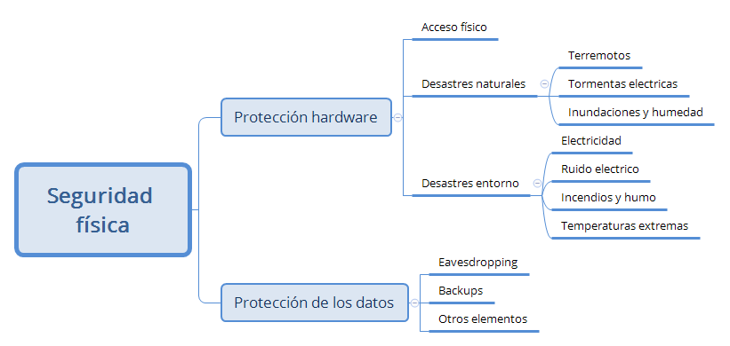

# Seguridad Informática. Conceptos. 

En los útlimos tiempos ha han realizado grandes avances en las tecnologías de la información y las comunicaciones, y se han introducido de forma generalizada en todos los sectores de la sociedad. Esto ha generado muchos benificios, y que hoy con un simple teléfono móbil, desde cualquier parte podamos por ejemplo realizar una transferencia bancaria. Pero todos estos avances, también traen consigo que tengamos nuevas vulnerabilidades de las que defendernos. En este documento trataremos de estudias la seguridad en las TIC. 

Un sistema informático tiene muchas partes, así que hay muchas cosas que proteger: 
- Hardware: aislamiento de los CPD, sistemas contra incendios, SAI's
- Software: antivirus, cortafuegos, ...

Los objetivos de un sistema de seguridad son mantener la información confidencial, íntegra y disponible. 

## Criterios de seguridad. 
- Confidencialidad. La información debe estar disponible solo para usuarios autorizados. 
- Integridad. Que no se pueda falsear la información. 
- Disponibildiad. 
- Autenticidad
- No repudio. 

## Tipos de vulnerabilidad. 
- Natural: desastres naturales o ambientales. 
- Física: acceso físico a los equipos infomáticos o a los medios de transmisión. 
- Lógica: Programas que pueden altera el almacenamiento, acceso o la transmisión de la información. 
- Humana: Las personas que utilizan y administran el sistema constituyen la mayor amenza

## Medidas de seguridad. 
Se suelen clasificar en 4 niveles: 

- Físico: impedir el acceso físico a los equipos. vigilancia, sistemas de contingencia. 
- Lógico. Programas que protejan el almacenamiento, acceso, transmisión (contraseñas, criptografía, cortafuegos). 
- Administrativo. En caso de que se produzca una violación de la seguridad ¿ como se delimitan las responsabilidades?.  Publicación de la política de seguridad. 
- Legal. Normalmente normas fijadas por gobiernos o instituciones internacionales. 

## Principios fundamentales. 

- Principio del menor privilegio
- Seguridad no equivale a oscuridad
- Principio del eslabon más débil. Un sistema es tan seguro como el eslabón más débil de la cadena. 
- Defensa en profundidad. La defensa no debe depender de un solo mecanismo. El atacante tendrá que superar varias barreras para acceder.
- Punto de control centralizado. Tratar de tener un único punto de acceso a nuestro sistema
- Seguridad en caso de fallo. 
- Participación universal. 
- Principio de simplicidad

## Seguridad Física. 
Como seguridad física nos referimos a todos aquellos elementos destinados a proteger físicamente cualquier recurso del sistema. 

### Protección del hardware. 

Nos enfrentamos a 3 problemas: 
- Acceso físico. 
- Desastres naturales. 
- Alteraciones del entorno. 

El acceso físico es un o de los más importantes de un sistema. Si un atacante tiene acceso físico al sistema, todas las demás medidas de seguridad son bastante inútiles. Un ataque de denegación de servicio se convierte en trivial (simplemente apagar el equipo), acceder a la información es más fácil (puedes copiar los discos), iniciar el sistema con un medio que permita realizar ataques, etc. Para evitarlos, todo tipos de sistemas de control de acceso, sistemas de vigilancia. 

Contra desastres naturales (tormentas electrcias, inundaciones, incendios, terremotos). Se pueden tomar muchos tipos de medidas. Por ejemplo: 
Ante un terremoto se pueden tomar medidas como situar los equipos en lugares bajos para evitar caídas, evitar  elementos móviles en lugares altos que se pueden caer encima, fijar elementos crítivos, colocar los equipos sobre plataformas de goma que absorvan las vibraciones. etc. 
Contra incendios, sistemas de apagado. 

Alteraciones del entorno. Los más comunes son los que tienen que ver con la electricidad, como cortes o picos (SAIS), temperaturas extremas (aire acondicionado)

### Protección de los datos. 
Además de proteger los datos, nuestra política de seguridad debe incluír medidas de protección de los datos. 
La interceptacióni de mensajes de uno de los aspectos a tener en cuenta. Contra ellos las medidas más efectivas son el cifrado de la información, es decir, usar versiones seguras de los protocolos de comunicación, como por ejemplo TLS. 
Copias de seguridad. Es importante proteger los sitios donde residen las copias de seguridad. Las copias deben estar deslocalizadas, pero además hay que proteger los accesos físicos de esos lugares. 
Otros elementos. En ocasiones los responsables de seguridad se olvidan de otros sitios donde también hay datos, como por ejemplo los documentos que se mandan a una impresora. 
Se deben tomar medidas como situar las impresoras, plotters, faces, etc en sitios de acceso restingido. También debe ser restringido el lugar donde se recogen esos documentos impresos. Otra medida es utiliar trituradora de papel para aquellos documentos que se van a desechar. 

## Seguridad Lógica. 
Aplicación de barreras y procedimientos que resguarden el acceso a los datos y solo permita acceder a las personas con autorización. 

### Amenazas lógicas: 

- Software con errores. Todo software contiene errores, y a menudo existen exploits que permiten aprovechar esos errores para hacerse con el control de una máquina. Contra esto, actualizaciones. 
- Herramientas de seguridad. Existen muchas herramientas de seguridad que relizarn análisis de vulnerabilidades en un sistema. Estas herramientas pueden ser utilizadas con fines maliciosos. Contra esto, utilizar esas mismas herramientas para mantener controlados los posibles problemas. 
- Puertas traseras. A veces se dejan para facilitar la administración de un sistema posteriormente y otra veces con fines menos buenos. En todo caso, si llegan a producción tenemos un problema importante. 
- Bombas lógicas. Son programas que permanecen inactivos, y que llegado un determinado evento se ejecutan intentando causar máximo daño posible. 
- Canales cubiertos. Son canales ocultos y no autorizados de comunicación que permiten a un proceso transferir información.
- Virus 
- Gusanos
- Troyanos
- Programas conejo o bacterias. 
- Técnicas salami. 

metodos: 
criptografía, firma digital, administración de seguridad, limitaciones de accesibilidad a los usuarios. 

