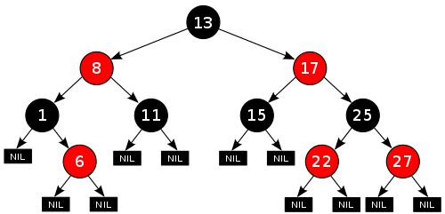

# Tipos Abstractos de Datos
Un TDA es un conjunto de datos u objetos al cual se le asocian operaciones. Al TDA se le asocia una interfaz con la cual es posible realizar las operaciones permitidas, abstrayendose de la manera en cmo estén implementadas. En este texto se estudiarán algunos tipos de datos básicos. 

## Listas
Una lista se define como una serie de N elementos ordenadores de manera consecutiva, es decir, el elemento Ek es previo al elemento Ek+1. Si la lista cotiene 0 elementos, se denomina lista vacía. 
Operaciones: 
- estaVacia()
- insertar(x,k). Inserta el elemento x en la posición k
- buscar(x). Devuelve la posición del elemento x en la lista
- buscarK(k). Devuelve el k-ésimo elemento de la lista. 
- eliminar(x). elimina de la lista al elemento x. 
Normalmente en una lista enlazada solo tenemos referencia al primer elemento, esto provoca que añadir o borrar de la primera posición es un caso especial, porque cambia la referencia de la lista. Además, en una lista, todo elemento tiene un predecesor, pero el primero no lo tiene. Para solucionar esto, utilizaremos una lista con un nodo de cabecera. 

## Pila

## Cola

## Cola de Prioridad. 

## Árbol
Es un tipo abstracto de dato, ampliamente utilizado que imita la estructura jerárquica de un árbol, con un valor en la raíz y subárboles con un nodo padre. 

### Terminología: 
- Raíz: Nodo superior de un árbol. 
- Hijo. Un nodo conectado directamente con toro, cuando se aleja de la raíz. 
- Padre: Noción inversa de hijo. 
- Hermanos: Un conjunto de nodos con el mismo padre. 
- Descendiente: Un nodo accesible por descenso repetido de padre a hijo. 
- Ancestro: Un nodo accesible por ascenso repetido de hijo a padre. 
- Hoja: nodo sin hijos. 
- Nodo interno: Nodo con al menos un hijo. 
- Grado: Nümero de subárboles de un nodo. 
- Brazo: La conexión entre un nodo y otro. 
- Camino: Secuencia de nodos y brazos conectados con un nodo descendiente. 
- Nivel: El nivel se define por 1 + el número de conexiones entre el nodo y la raíz. 
- Altura de un nodo: La altura de un nodo es el número de aristas en el camino más largo entre ese nodo y una hoja. 
- Altura de un árbol: Se define como la altura del nodo raíz. 
- Profundidad: La profundidad de un nodo es el número de aristas desde la raíz del ábol hasta un nodo. 
- Bosque. Conjunto de árboles disjuntos. 
- Rama: Ruta de la raíz a cualquier nodo. 

### Operaciones comunes: 
- Enumerar todos los elementos. 
- Enumerar la sección de un árbol. 
- Buscar un elemento. 
- Añadir un nuevo elemento en una determinada posición de árbol. 
- Borrar un elemento. 
- Podar. Borrar una sección entera de un árbol. 
- Injertar. Añadir una sección entera a un árbol. 
- Buscar la raíz de un nodo. 
- Representar cada nodo como una variable en el montículo con punteros. 
- Representar el árbol con un vector. 

### Tipos de árboles: 
- Árboles Binarios. 
- Árboles Binarios de Búsqueda. 
- Árboles AVL. 
- Árboles Rojo-Negro.
- Árboles AA. 
- Árbol de segmento. 
- Árboles Multicamino.
- Árboles B (Árboles de búsqueda multicamino autobalanceados)
- Árbol B+
- Árbol B*

#### Árbol Binario: 
Es un tipo de árbol en el cual cada nodo puede tener un hijo izquierdo y un hijo derecho. 
Usos c

#### Árbol AVL: 
El árbol AVL toma su nombre de las iniciales de los apellidos de sus inventores, Georgii Adelson-Velskii y Yevgeniy Landis. Lo dieron a conocer en la publicación de un artículo en 1962, «An algorithm for the organization of information» («Un algoritmo para la organización de la información»). 
Los árboles AVL siempre están equilibrados, de tal modo que para todos los nodos, la altura de la rama izquierda no difiere en más de una unidad a la altura de la rama derecha. Gracias a esta forma de equilibrio (o balanceo), la complejidad de una báuqueda en uno de estos árboles se mantiene siempre en orden de complejidad O(log n). 
Para conseguir este equilibrio, la inserción y borrado de nodos ha de hacerse de una forma especial. Si al insertar o borrar un nodo, se pierde el equilibrio, hay que realizar una serie de rotaciones de los nodos. 
Más información: https://es.wikipedia.org/wiki/%C3%81rbol_AVL

#### Árbol Rojo-Negro: 
Es un árbol binario de búsqueda equilibrado. Es un sistema complejo, pero tiene un buen peor caso de tiempo de ejecución para sus ope4raciones y es eficiente en la practica. 
Puede buscar, insertar y borrar en un tiempo O(log n), donde n es el número de nodos del árbol. 
En los árboles rojo-negro las hojas no son relevantes y no contienen datos. 
En ellos, cada nodo tiene un atributo de color, cuyo valor es *rojo* o *negro*. Se deben tener las siguientes reglas: 
- Todo nodo es bien rojo o bien negro. 
- La raíz es negra. 
- Todas las hojas (NULL) son negras. 
- Todo nodo rojo debe tener dos nodos hijos negros. 
- Cada camino desde un nodo dado a sus hojas descendientes contiene el mismo número de nodos negros. 
Estas reglas producen una regla crucial para los árboles rojo-negro: el camino más largo desde la raíz hasta una hoja no es más largo que dos veces el camno más corto desde la raíz a una hoja. El resultado es que dicho árbol está aproximadamente equilibrado. 

Los árboles rojo-negro ofrecen un peor caso con tiempo garantizado para la inserción, el borrado y la búsqueda. No es esto únicamente lo que los hace valiosos en aplicaciones sensibles al tiempo como las aplicaciones en tiempo real, sino que además son apreciados para la construcción de bloques en otras estructuras de datos que garantizan un peor caso. Por ejemplo, muchas estructuras de datos usadas en geometría computacional pueden basarse en árboles rojo-negro. 
El árbol AVL es otro tipo de estructura con O(log n) tiempo de búsqueda, inserción y borrado. Está equilibrado de forma más rígida que los árboles rojo-negro, lo que provoca que la inserción y el borrado sean más lentos pero la búsqueda y la devolución del resultado de la misma más veloz.

Los árboles rojo-negro son particularmente valiosos en programación funcional, donde son una de las estructuras de datos persistentes más comúnmente utilizadas en la construcción de arrays asociativos y conjuntos que pueden retener versiones previas tras mutaciones. La versión persistente del árbol rojo-negro requiere un espacio O(log n) para cada inserción o borrado, además del tiempo.

Los árboles rojo-negro son isométricos a los árboles 2-3-4. En otras palabras, para cada árbol 2-3-4, existe un árbol correspondiente rojo-negro con los datos en el mismo orden. La inserción y el borrado en árboles 2-3-4 son también equivalentes a los cambios de colores y las rotaciones en los árboles rojo-negro. Esto los hace ser una herramienta útil para la comprensión del funcionamiento de los árboles rojo-negro y por esto muchos textos introductorios sobre algoritmos presentan los árboles 2-3-4 justo antes que los árboles rojo-negro, aunque frecuentemente no sean utilizados en la práctica. 

#### Árbol AA: 
Es una variación del árbol rojo-negro, que a su vez es una mejora del árbol binario de búsqueda. A diferencia de los árboles rojo-negro, los nodos rojos de un árbol AA sólo pueden añadirse como un hijo derecho. En otras palabras, ningún nodo rojo puede ser un hijo izquierdo. De esta manera se simula un árbol 2-3, en lugar de un árbol 2-3-4, lo cúal simplifica las operaciones de mantenimiento. 

#### Árbol de segmento: 
Es una estructura de datos en forma de árbol para guadar intervalos o segmentos. Permite consutlar cuál de los segmentos guardados contiene un punto. Este es, en pricipio una estructura estática. Es decir, su contenido no puede ser modificado una vez que su estructura es construída. 
Tienen aplicaciones son vistas en las áreas de la geometría computacional y en los sistemas de información geográfica. 
https://es.wikipedia.org/wiki/%C3%81rbol_de_segmento

#### Árbol-B: 
Son árboles balanceados de búsqueda, pero cada nodo puede poseer más e dos hijos. Los árboles B mantienen los datos ordenados y las inserciones y eliminaciones se realizan en tiempo logarítmico amortizado. 
El uso se encuentra comunmente en las implementaciones de bases de datos y sistemas de archivos. 

La idea de los árboles B es que los nodos internos deben tener un número variable de nodos hijo dentro de un rango predefinido. Cuando se inserta o se elimina un dato de la estructura, la cantidad de ntodos hijo varía dentro de un nodo. Para que siga manteniéndose el número de nodos dentro del rango predefinido, los nodos internos se juntan o se parten. Dado que permite un rango variable de hijos, los árboles-b no necesitan rebalancearse tan frecuentemente. 
https://es.wikipedia.org/wiki/%C3%81rbol-B

#### Árbol-B+ : 
En un árbol B+, toda la información se guarda en las hojas. Los nodos internos sólo contiene claves y punteros. Todas las hojas se encuentran al mismo nivel, que se corresponde con el más bajo. Los nodos hoja se encuentran unidos entre sí como una lista enlazada para permitir principalmente recuperación en el rango mediante búsqueda secuencial 

#### Árbol-B* : 
Se utlizar en los sistemas de ficheros HFS y Reiser4. 
....
